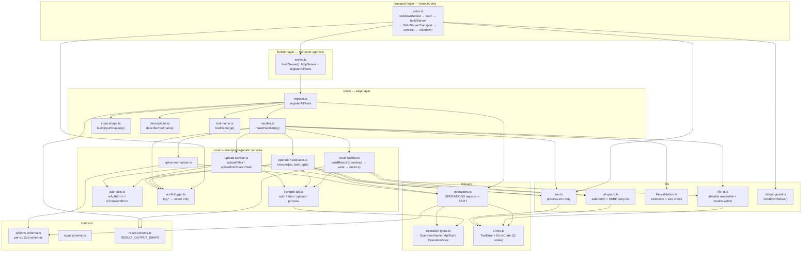

# Architecture

## 1. Overview

`ilovepdf-mcp` is a **headless, client-agnostic MCP server** that speaks the Model Context Protocol over **stdio** (`StdioServerTransport`). It exposes exactly **10 iLovePDF tools**, generated data-drivenly by iterating the `OPERATIONS` registry in `domain/operations.ts` — the single source of truth. A tool call resolves local-path or URL inputs through a deny-by-default allowlist, uploads them to the iLovePDF v1 REST API, triggers processing, downloads the produced file, writes it to the allowlisted working directory, and returns a structured `CallToolResult` (not a rendered widget). The design isolates the stdio transport to a single file (`index.ts`) so a future Streamable HTTP entry point is purely additive.

---

## 2. Layered module diagram

Strict, one-directional dependency layers. Nothing under `domain/`, `contract/`, `core/`, or `lib/` may import `tools/`, `server.ts`, or any transport — enforced by `test/server-isolation.test.ts`.



---

## 3. Tool generation (registry-driven)

`registerAllTools` iterates `OPERATION_NAMES` (the ordered key array of `OPERATIONS`) and calls `server.registerTool` exactly once per entry. Every aspect of each tool — name, title, description, input schema, output schema, and handler — is derived from the registry. Adding an 11th entry to `OPERATION_NAMES` produces an 11th tool with **zero changes** to `register.ts` or `server.ts`.

```mermaid
flowchart TD
    subgraph ssot["domain/operations.ts — single source of truth"]
        opnames["OPERATION_NAMES\n['compress-pdf', 'pdf-to-jpg', ..., 'pdf-ocr']"]
    end

    subgraph loop["register.ts — registerAllTools(server)"]
        iter["for const name of OPERATION_NAMES"]
        spec["specFor(name) → OperationSpec\n{ name, apiTool, label, acceptedExtensions,\n  defaultOptions, requiresSharedTask, optionsSchema }"]
    end

    subgraph derivation["per-operation derivation — tools/"]
        tn["toolName(op)\n→ 'ilovepdf_compress_pdf', …\nrule: ilovepdf_ + snake_case(name)"]
        is["buildInputShape(op)\n→ ZodRawShape { sources, output_path?, options? }"]
        dt["describeTool(name)\n→ short description string"]
        mh["makeHandler(op)\n→ async (args) → CallToolResult"]
    end

    rs["contract/result-schema.ts\nRESULT_OUTPUT_SHAPE\n(shared outputSchema across all 10 tools)"]

    call["server.registerTool(\n  name,\n  { title, description, inputSchema,\n    outputSchema, annotations },\n  handler\n)\n× 10 calls — one per OPERATION_NAMES entry"]

    opnames --> iter --> spec
    spec --> tn & is & dt & mh
    tn & is & dt & mh & rs --> call
```

**Tool naming rule (DEC-1):** `ilovepdf_` + operation name with every `-` replaced by `_`. No exceptions or manual overrides in v1.

---

## 4. The 10 tools

Sourced directly from `src/domain/operations.ts`. `requiresSharedTask` means all sources land in one iLovePDF task (required for multi-input operations). `producesArchive` means the output is a `.zip` file bundling multiple produced files.

| Operation name | MCP tool name | Purpose | `requiresSharedTask` | `producesArchive` |
|---|---|---|:---:|:---:|
| `compress-pdf` | `ilovepdf_compress_pdf` | Reduce PDF file size while preserving quality | — | — |
| `pdf-to-jpg` | `ilovepdf_pdf_to_jpg` | Convert PDF pages to JPEG images | — | ✓ |
| `image-to-pdf` | `ilovepdf_image_to_pdf` | Convert images (JPG, PNG, TIFF) to PDF | ✓ | — |
| `office-to-pdf` | `ilovepdf_office_to_pdf` | Convert Word, Excel, and PowerPoint files to PDF | — | — |
| `merge-pdf` | `ilovepdf_merge_pdf` | Combine multiple PDF files into one | ✓ | — |
| `split-pdf` | `ilovepdf_split_pdf` | Split a PDF into multiple files by page range or chunks | — | ✓ |
| `watermark` | `ilovepdf_watermark` | Add a text or image watermark to a PDF | — | — |
| `pagenumber` | `ilovepdf_pagenumber` | Add page numbers to a PDF | — | — |
| `pdf-ocr` | `ilovepdf_pdf_ocr` | Extract text from scanned PDFs using OCR | — | — |

> **`unlock` is TEMPORARILY DISABLED.** Its logic is preserved but commented out
> in the source and it is not registered as an MCP tool. When re-enabled it will
> appear as `ilovepdf_unlock` and carry `mustBeDirect: true`, forcing the DIRECT
> execution path in the executor regardless of the task tool assigned at upload time.

---

## 5. Request lifecycle sequence

A `tools/call` for `ilovepdf_compress_pdf` flows through the following steps. Auth errors trigger a re-auth-once retry; transient 5xx errors (502/503/504) trigger a single 500 ms delay and retry; the entire upload flow is retried up to 2 additional times on bad regional nodes (ERR-4, ERR-5, ERR-6).

```mermaid
sequenceDiagram
    participant C as MCP Client
    participant H as handler.ts
    participant F as file-io.ts
    participant V as file-validation.ts
    participant N as option-normalizer.ts
    participant U as upload-service.ts
    participant X as operation-executor.ts
    participant A as iLovePDF API
    participant R as result-builder.ts

    C->>H: tools/call { sources, output_path?, options? }
    H->>H: assertCardinality(op, sources)
    H->>F: loadAllowlist() → Allowlist
    H->>F: readInputFile(path, allow) per local source<br/>resolveWithin → lexical pre-check → realpathSync → containment re-check
    H->>V: validateInputs(files, op.acceptedExtensions)
    H->>H: requireEnv(ILOVEPDF_PUBLIC_KEY) — lazy CONFIG_ERROR if unset
    H->>N: normalizeOptions(op, merged options)

    alt requiresSharedTask (e.g. merge-pdf, image-to-pdf)
        H->>U: uploadIntoSharedTask(op, files, env)
    else single-source operations
        H->>U: uploadFiles(op, files, env)
    end

    loop bad-node retry — up to 3 attempts (+500ms / +1000ms delay)
        U->>A: POST /v1/auth { public_key } → JWT token
        U->>A: GET /v1/start/{apiTool} → { server, task }
        loop per source file
            U->>A: POST /v1/upload (binary bytes or cloud_file URL)
            note over U,A: 401/403 → re-auth once then retry (ERR-4)
        end
    end
    U-->>H: TaskCreds { server, task, token, task_tool, files }

    H->>X: execute(op, taskCreds, options)
    X->>X: idempotency guard — processedTasks Set (ERR-7)
    X->>A: POST /v1/process → ILovePDFProcessResponse
    note over X,A: 401/403 → re-auth once + retry (ERR-4)<br/>502/503/504 → wait 500ms, retry once (ERR-6)
    X-->>H: ExecuteResult { download_url, output_filename, file_count, … }

    H->>R: buildResult({ op, exec, sources, allow, startedAt })
    R->>R: assertAllowedDownloadHost — host must end in .ilovepdf.com (SSRF-5)
    R->>A: safeFetch(download_url) — SSRF guard on every redirect hop (SSRF-4)
    R->>F: resolveOutputPath → resolveWithin write mode
    R->>F: writeOutputFile(absPath, buffer)
    R->>R: stripCredential(download_url) — drop ?token= query string (DEC-4)
    R->>R: compute metrics { inputBytes, outputBytes, ratio, durationMs }
    R-->>H: { content: [text/markdown summary], structuredContent }

    H-->>C: CallToolResult (isError:false on success; isError:true on ToolError)
```

---

## 6. stdout / stderr discipline

On stdio, **stdout is reserved exclusively for MCP JSON-RPC frames** — a single stray byte corrupts the protocol. Three layers enforce stderr-only logging (LOG-1..LOG-6):

1. **`lockdownStdout()`** in `index.ts` rebinds `console.log/info/debug` to `console.error` (stderr) **before** `buildServer()` or `server.connect()` can run. It deliberately leaves `process.stdout.write` untouched — the SDK transport needs it for protocol frames.
2. **`audit-logger.ts`** emits exclusively via `console.error`. All modules import `log.*` from it instead of calling `console` directly.
3. **ESLint `no-console` rule:** only `console.error`/`console.warn` are permitted in the codebase; new code must use the `log` facade.

---

## 7. Error model

All error paths throw a typed `ToolError` carrying a stable `ErrorCode`, an internal diagnostic `message`, a user-safe `userMessage`, and a `retryable` flag (ERR-1, ERR-2). The handler catches `ToolError` and returns `isError: true` in `CallToolResult` — throwing is reserved for unrecoverable protocol-level faults only. The raw diagnostic `message` is routed to the stderr audit log and **never** returned to the client (DEC-5).

**The 11 `ErrorCode` values** (from `src/domain/errors.ts`):

| Code | When |
|---|---|
| `UPLOAD_FAILED` | File upload to iLovePDF servers failed |
| `PROCESS_FAILED` | iLovePDF `/process` call failed |
| `AUTH_FAILED` | Authentication or re-auth retry exhausted |
| `UNSUPPORTED_EXTENSION` | File extension not accepted for the requested operation |
| `UPSTREAM_ERROR` | iLovePDF returned an unexpected or non-auth error |
| `VALIDATION_ERROR` | Input failed Zod schema validation, or SSRF guard rejected a URL |
| `INTERNAL` | Unexpected server-side error with no more-specific code |
| `TASK_ALREADY_PROCESSED` | Idempotency guard: task already processed in this request |
| `FILE_ACCESS_DENIED` | Local path fell outside the configured allowlist |
| `FILE_NOT_FOUND` | Local input file does not exist or is unreadable |
| `CONFIG_ERROR` | Required env var (e.g. `ILOVEPDF_PUBLIC_KEY`) is missing |

**Structured failure payload** (`ToolError.toStructured()`, returned when `isError: true`):

```jsonc
{
  "success": false,
  "error_code": "UPLOAD_FAILED",                 // stable ErrorCode
  "error": "Upload failed. Please try again.",   // userMessage — safe to surface to client
  "detail": "raw API error text…",               // internal; logged to stderr only (DEC-5)
  "retryable": true
}
```

---

## 8. Result contract (success)

The result builder assembles the LOCKED `structuredContent` shape (TOOL-5) plus a `content` array with the following layout:

| Index | Type | Present | Description |
|---|---|:---:|---|
| 0 | `text` | Always | Concise markdown op summary (sizes, file count, absolute path). |
| 1 | `resource` | Only when `ILOVEPDF_MCP_EMBED_RESULT=true` **and** output ≤ `ILOVEPDF_MCP_MAX_INLINE_MB` | Embedded blob (base64 of the output file). |
| last | `resource_link` | Only when `ILOVEPDF_MCP_EMBED_RESULT=true` | `file://` URI + filename + MIME type. Present within embed mode even when the blob is omitted due to the cap. |

**Default content is text-only.** By default, the `content` array contains only the text block (index 0). This is the maximally client-compatible default: some clients — notably Claude Desktop — reject tool results that include embedded resources with non-text MIME types (e.g. `application/pdf`), returning a "media_type not allowed" error for the entire tool response. Set `ILOVEPDF_MCP_EMBED_RESULT=true` to also include the embedded blob and resource_link for clients that support them (e.g. MCP Inspector).

**`structuredContent.output.download_url`** has the `?token=` query string stripped before it leaves the server (DEC-4 — credential never returned to client). Set `ILOVEPDF_MCP_RETURN_DOWNLOAD_URL=true` to return the raw tokenized URL instead (see security.md §4.5 for the trade-off).

**Never-overwrite guarantee:** if the resolved output path would equal any resolved local input source path, `buildResult` throws `VALIDATION_ERROR` before writing a single byte. Additionally, `deriveOutputFilename` detects when the upstream filename equals an input basename and falls back to the `<stem>-<apiTool>.<ext>` pattern so the default output always differs from the input.

```jsonc
// structuredContent (always present)
{
  "operation": "compress-pdf",
  "status": "completed",
  "input":   { "sources": ["/abs/in.pdf"], "count": 1, "totalBytes": 2516582 },
  "output":  { "path": "/abs/in-compress.pdf",
               "download_url": "https://api7.ilovepdf.com/v1/download/…",
               "bytes": 1153433, "fileCount": 1 },
  "metrics": { "inputBytes": 2516582, "outputBytes": 1153433,
               "ratio": 0.458, "durationMs": 812 }
}

// content[0] — text block (always present — default content is text-only)
{ "type": "text", "text": "Compressed 1 PDF: 2.4 MB → 1.1 MB (54% smaller). Saved to `/abs/in-compress.pdf`." }

// content[1] — embedded resource (only when ILOVEPDF_MCP_EMBED_RESULT=true AND output ≤ cap)
{ "type": "resource", "resource": { "uri": "file:///abs/in-compress.pdf", "mimeType": "application/pdf", "blob": "<base64>" } }

// content[last] — resource link (only when ILOVEPDF_MCP_EMBED_RESULT=true)
{ "type": "resource_link", "uri": "file:///abs/in-compress.pdf", "name": "in-compress.pdf", "mimeType": "application/pdf" }
```

The same `RESULT_OUTPUT_SHAPE` (`contract/result-schema.ts`) is the `outputSchema` for every registered tool. The SDK validates `structuredContent` against it before returning to the client, enforcing the LOCKED contract at runtime.

**Environment variables for result behavior:**

| Env var | Default | Description |
|---|---|---|
| `ILOVEPDF_MCP_EMBED_RESULT` | `false` | When `true` or `1`, appends an embedded `resource` blob and `resource_link` to the `content` array. Off by default for Claude Desktop compatibility. Enable for clients that support embedded resources (e.g. MCP Inspector). |
| `ILOVEPDF_MCP_MAX_INLINE_MB` | `10` | Max output size (MB) to embed as a base64 blob (applies only when `ILOVEPDF_MCP_EMBED_RESULT=true`). Set `0` to suppress the blob while keeping the `resource_link`. |
| `ILOVEPDF_MCP_RETURN_DOWNLOAD_URL` | `false` | When `true`, returns the raw tokenized `download_url` in `structuredContent.output`. |

---

## 9. Tech stack

| Concern | Choice |
|---|---|
| Runtime | Node 18+ — global `fetch`/`FormData`/`Blob`/`File`; no extra HTTP client dependency |
| Language | TypeScript ^5 — ESM, `module`/`moduleResolution: NodeNext`, `strict`. **`.js` extensions required** on all relative imports |
| MCP SDK | `@modelcontextprotocol/sdk` ^1 — `McpServer` + `StdioServerTransport` |
| Schema | `zod` ^3 — authoritative for all input and output shapes; SDK derives JSON Schema from the `ZodRawShape`; no hand-maintained JSON copies |
| Tests | `vitest` ^2 — node env, globals; 287 tests green across 26 files |
| Lint | ESLint — `no-console` allows only `console.error`/`console.warn` |
| Format | Prettier — `singleQuote`, `arrowParens: avoid`, `trailingComma: es5` |
