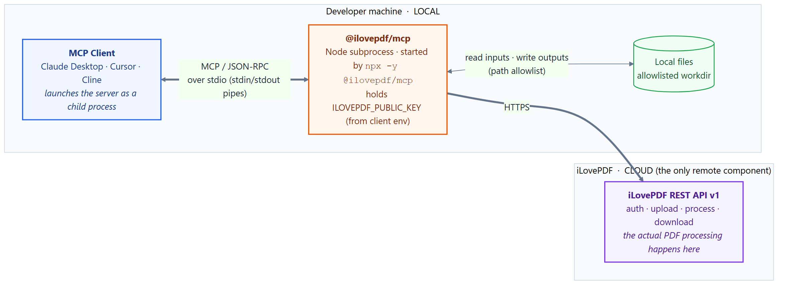
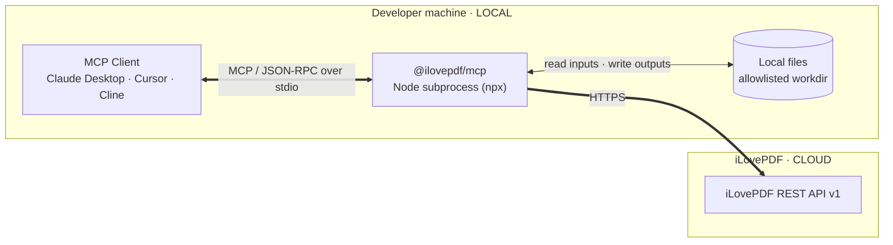

# Deployment & Runtime Model

This document explains **where each part of `@ilovepdf/mcp` runs**, how the MCP
protocol travels, why we chose a **local stdio** server over a remote/hosted one,
and how that compares to what the rest of the industry does.

> TL;DR — the server runs **locally**, as a child process of your MCP client. The
> **only** cloud component is the iLovePDF REST API (where the actual PDF work
> happens). There is **no Cloudflare Worker** — that was the previous architecture
> we deliberately moved away from.

## 1. Where each thing runs

Mermaid source

There are **three physical locations**:

| # | Component | Where it runs | Role |
|---|-----------|---------------|------|
| 1 | **MCP client** (Claude Desktop, Cursor, Cline, …) | Developer's machine | Hosts the model; **launches** the server as a child process. |
| 2 | **`@ilovepdf/mcp` server** | Developer's machine (subprocess via `npx -y @ilovepdf/mcp`) | **Orchestrator/bridge.** Reads local files, uploads to iLovePDF, triggers processing, downloads the result, writes it locally. Holds the developer's `ILOVEPDF_PUBLIC_KEY`. |
| 3 | **iLovePDF REST API** | iLovePDF cloud | The **only** remote component — performs the actual PDF operation. |

The server does **not** process PDFs itself; it is a thin, secure bridge between the
model and the iLovePDF cloud API.

## 2. How the protocol travels (and why stdout is sacred)

The client **spawns the server as a subprocess** and they exchange newline-delimited
JSON-RPC messages over OS pipes:

- **Client → server:** writes JSON-RPC to the server's **stdin**.
- **Server → client:** writes JSON-RPC to its **stdout**.

The MCP spec is explicit: *"The server **MUST NOT** write anything to its `stdout`
that is not a valid MCP message,"* and logging *"MAY"* go to **stderr**
([spec — Transports](https://modelcontextprotocol.io/docs/concepts/transports)). A
single stray `console.log`, startup banner, or noisy dependency writing to stdout
**corrupts the JSON-RPC stream and silently breaks the client** — the most common
stdio bug. This is exactly why our design mandates stderr-only logging plus
`lockdownStdout()` (see `LOG-1..LOG-6` and `docs/architecture.md` §5).

## 3. The two MCP transports

The spec (2025-06-18) defines exactly two standard transports; clients **SHOULD
prefer stdio** when possible.

| | **stdio** (our choice) | **Streamable HTTP** |
|---|---|---|
| Runs | Local subprocess | Long-running hosted service |
| Channel | stdin/stdout pipes | Single HTTP `POST`/`GET` endpoint (optional SSE streaming) |
| Sessions | Implicit (1 process = 1 session) | Explicit `Mcp-Session-Id` header |
| Auth | OS process ownership (none needed) | OAuth 2.1 + PKCE, `Origin` validation, token-audience checks |

> **History:** Streamable HTTP (spec 2025-03-26) **replaced** the older HTTP+SSE
> transport, which used two endpoints and an always-open stream that fought load
> balancers and serverless platforms. The old Cloudflare Worker lived in this
> remote-HTTP world.

## 4. Why local/stdio for this project

`@ilovepdf/mcp` has two hard requirements that decide the transport:

1. **Local filesystem I/O** — it must read input PDFs and write outputs on the
   developer's disk. A remote server can't touch your filesystem.
2. **Per-developer API key** — each developer uses their own `ILOVEPDF_PUBLIC_KEY`,
   supplied via client config; it never leaves their machine.

Local stdio satisfies both and eliminates the entire auth/session/hosting layer.

| Dimension | Local (stdio, npx) — **ours** | Remote (Streamable HTTP, hosted) |
|---|---|---|
| Filesystem access | Native (user's FS permissions) | None by default |
| Credentials | Per-dev env var, stays local | Server holds/relays; needs secrets store |
| Auth | Process boundary *is* the auth | Full OAuth 2.1 stack |
| Multi-tenancy | One instance per dev — non-issue | Must isolate tenants/sessions/rate limits |
| Distribution / updates | `npx` fetches on demand; no deploy | You deploy & operate; central updates |
| Latency | Only the outbound iLovePDF call crosses the net | Extra client→server hop |
| Hosting cost/ops | Zero | You pay for & run hosting, scaling, on-call |
| Discoverability | Lower (install a package) | Higher (a shareable URL) |

**Counter-argument (acknowledged):** some enterprise voices argue that servers making
credentialed API calls *should* be remote-only, so keys sit behind central controls
rather than in local plaintext config. For a per-developer dev tool that needs local
files, the filesystem requirement outweighs this — but it's the reason the core is
kept **transport-agnostic**: a remote variant remains an additive option later.

## 5. What would change if we ever went remote

The core (`domain/`, `contract/`, `core/`, `lib/`) stays untouched. Only the edges change:

- Swap `StdioServerTransport` → `StreamableHTTPServerTransport` on a single `/mcp` endpoint (add `src/http.ts`, reuse `buildServer()`).
- Add an **auth layer**: OAuth 2.1 + PKCE, `Origin` validation, session IDs, token-audience checks.
- Replace local file I/O with an upload/download model (no direct FS).
- Client config becomes a **URL + token flow** instead of a `command`/`args`/`env` block.
- Add hosting, monitoring, scaling, and multi-tenant isolation.

## 6. Best practices we follow

Distilled from the MCP spec, Anthropic's tool-design guidance, and security write-ups
(see Sources):

- **Tool design** — one focused capability per tool, namespaced names, unambiguous
  params, descriptions that say when *not* to use a tool. (Our registry-driven
  `ilovepdf_*` tools already follow this.)
- **stdout discipline** — stderr-only logging; nothing but JSON-RPC on stdout.
- **Filesystem least privilege** — directory allowlist + path canonicalization,
  reject `..` traversal and symlink escapes (see `docs/security.md`, `FIO-*`).
- **Keep the API key server-side; never broker third-party tokens** — trivial in a
  single-owner local process (token pass-through is explicitly forbidden by the spec).
- **Typed errors + retry** for transient upstream/network failures (`ERR-*`).

### SSRF on URL inputs — network egress guard

Our tools accept **URLs** as sources (not just local paths). The `file-io` allowlist
protects the filesystem but does **not** cover outbound URL fetches — a model could be
induced to target internal addresses (private ranges, or the cloud metadata endpoint
`169.254.169.254`), a classic **SSRF** vector.

This is now covered by a dedicated spec:
[`network-egress-ssrf.md`](../openspec/specs/network-egress-ssrf.md)
(SSRF-1…SSRF-6, decision `DEC-3`). A new `lib/url-guard.ts` module enforces a
deny-by-default egress guard: http(s)-only schemes, blocked private/loopback/link-local/
metadata ranges, **resolved-IP** validation (DNS-rebinding defense), redirect
re-validation, and host-constraining the iLovePDF `download_url`. Note the scoping
nuance: URL *inputs* are delegated to iLovePDF's cloud upload (they fetch, not us), so
the full guard applies to URLs **this server** fetches (the result download), plus
scheme/IP-literal pre-validation before delegating inputs. Implemented by tasks
T059–T062.

> This matters because the server holds two legs of the "lethal trifecta" (access to
> local data + an outbound channel); untrusted file contents and paths should be
> treated as an injection surface.

## 7. Industry landscape & competitors

**Transport by use case:** local-first (stdio/npx) dominates developer tooling and
anything needing local files or a local browser; remote + OAuth dominates hosted SaaS.
GitHub ships **both** (hosted remote *and* a local build), showing they're complementary.

- **Local, npx-style:** Anthropic reference servers (Filesystem, Git, Fetch),
  Playwright MCP (`@playwright/mcp`), the local GitHub MCP build.
- **Remote, hosted (Streamable HTTP + OAuth):** Cloudflare's managed MCP catalog,
  Sentry, Stripe, Notion, Neon, Vercel.

`@ilovepdf/mcp` sits squarely in the **local-first developer-tool** camp.

### PDF / document competitors

| Product | Type | Distribution | Notes |
|---|---|---|---|
| **`adamdavis99/ilovepdf-mcp`** | **Direct competitor** (unofficial) | TS + MCP SDK; `npm i -g`, local stdio; Claude Desktop config | ~22 iLovePDF tools. The one true head-to-head. **No official `@ilovepdf` MCP exists** — that's our differentiator. |
| **PDF.co MCP** (official) | Vendor-wraps-own-SaaS | Local runner (uvx/npx-style) | Closest analog to our positioning (official vendor MCP). |
| **Stirling-PDF MCP** | Adjacent | Local server → self-hosted Stirling-PDF engine | Wraps a self-hostable engine, not a cloud API. |
| **Adobe PDF Services** | Competitor (cloud) | No official Adobe MCP; 3rd-party hosted wrappers (StackOne, Pipedream) | Adobe's other MCPs lean remote/hosted. |
| **Smallpdf** | Competitor (cloud) | ChatGPT-native app (OpenAI Apps SDK), not classic MCP | Different distribution channel. |

**Our differentiator:** be *the* **official** iLovePDF MCP — headless, client-agnostic,
with cleaner namespaced tool design and stronger security than the unofficial community
package.

> **Unverified claim to double-check before publishing:** "no official iLovePDF or
> Adobe PDF Services MCP" is based on absence of evidence in research — confirm on npm
> under the `@ilovepdf` scope and Adobe's developer portal first.

## Sources

- [MCP spec — Transports](https://modelcontextprotocol.io/docs/concepts/transports)
- [MCP — Security Best Practices](https://modelcontextprotocol.io/docs/tutorials/security/security_best_practices)
- [Anthropic — Writing effective tools for AI agents](https://www.anthropic.com/engineering/writing-tools-for-agents)
- [Why MCP deprecated SSE for Streamable HTTP — fka.dev](https://blog.fka.dev/blog/2025-06-06-why-mcp-deprecated-sse-and-go-with-streamable-http/) · [Auth0 — MCP Streamable HTTP](https://auth0.com/blog/mcp-streamable-http/)
- Local vs remote: [yaw.sh](https://yaw.sh/blog/local-vs-remote-mcp-servers/) · [Christian Posta](https://blog.christianposta.com/mcp-should-be-remote/) · [Red-gate](https://www.red-gate.com/simple-talk/ai/local-vs-remote-mcp-servers-which-should-you-choose/)
- Examples: [Anthropic reference servers](https://github.com/modelcontextprotocol/servers) · [GitHub MCP](https://github.com/github/github-mcp-server) · [Playwright MCP](https://github.com/microsoft/playwright-mcp) · [Cloudflare remote MCP](https://blog.cloudflare.com/remote-model-context-protocol-servers-mcp/)
- PDF competitors: [adamdavis99/ilovepdf-mcp](https://github.com/adamdavis99/ilovepdf-mcp) · [pdfdotco/pdfco-mcp](https://github.com/pdfdotco/pdfco-mcp) · [gufao/mcp-server-stirling-pdf](https://github.com/gufao/mcp-server-stirling-pdf)
