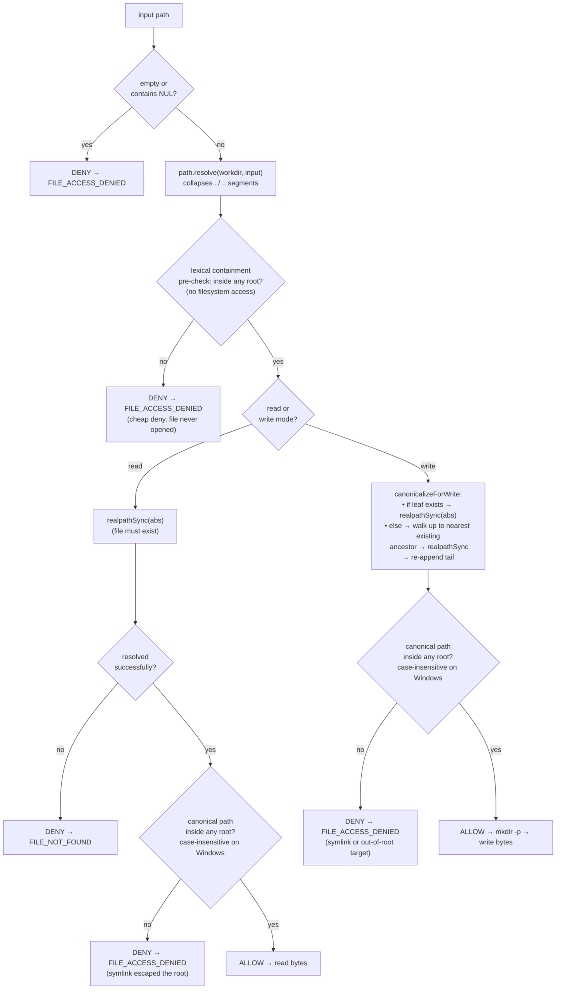
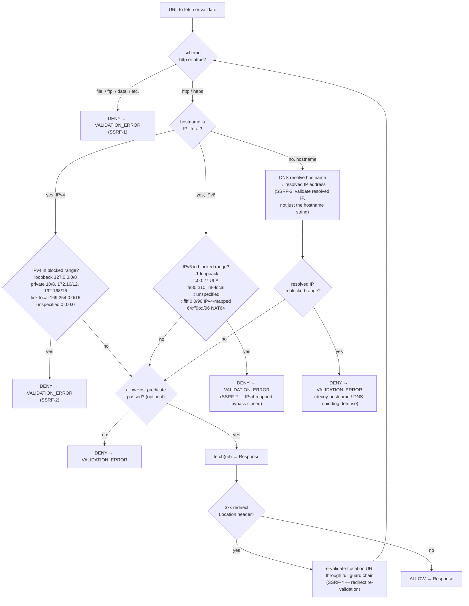

# Security

This document covers the primary security surfaces of `ilovepdf-mcp`: the local filesystem allowlist, the network egress / SSRF guard, and credential handling.

---

## 1. Threat model and trust boundaries

`ilovepdf-mcp` is a **local, single-user stdio server**: it runs as a child process of an MCP client (Claude Desktop, Cursor, etc.) on the developer's own machine. There is no multi-tenancy, no remote authentication, and no network-reachable endpoint — the OS process boundary is the session boundary.

**Trust boundaries:**

| Boundary | Trust level | Risk |
|---|---|---|
| MCP client ↔ server (stdin/stdout) | Trusted — same machine, OS pipes | Prompt-injection / adversarial model inputs manipulate `sources` and `output_path` |
| Server → iLovePDF REST API (HTTPS) | Semi-trusted — remote service | SSRF via crafted `download_url`; upstream error leaking internal detail |
| Server → local filesystem | Untrusted inputs — model-driven | Path traversal, symlink escape, out-of-root reads/writes |
| `ILOVEPDF_PUBLIC_KEY` | Secret on developer's machine | Must not leak to client, logs, or the MCP result |

**Primary threats:**

- **Path traversal / symlink escape:** a model-influenced `sources` path or `output_path` pointing outside the working directory could read arbitrary local files or clobber them. Mitigated by the deny-by-default allowlist (`lib/file-io.ts`).
- **SSRF via URL inputs:** a model-influenced `http(s)://` source or redirect from the iLovePDF download endpoint could target internal services, the cloud metadata endpoint (`169.254.169.254`), or arbitrary hosts. Mitigated by `lib/url-guard.ts` (`safeFetch`).
- **Credential leak:** the iLovePDF download URL embeds a task-scoped bearer token (`?token=<jwt>`) that must not reach the MCP client or appear in logs. Mitigated by DEC-4 (stripping) and the audit-logger's redaction passes.
- **Information disclosure:** raw API error text or absolute file paths must not reach the MCP client. Mitigated by DEC-5 (minimal-disclosure error surface).

---

## 2. File-IO allowlist — path-traversal defense

`lib/file-io.ts` is the **highest-risk surface** in the server. It enforces a **deny-by-default working-directory allowlist**: a path is usable only if it canonicalizes to a location inside a configured root. Anything outside is denied with `FILE_ACCESS_DENIED`.

### 2.1 Configuration

| Env var | Role | Default |
|---|---|---|
| `ILOVEPDF_MCP_WORKDIR` | Primary allowlist root **and** default output directory | `process.cwd()` (bounded to wherever the client launched the server) |
| `ILOVEPDF_MCP_ALLOWED_DIRS` | Optional extra roots, split on `path.delimiter` (`;` Windows, `:` POSIX) | None |

All roots are resolved to absolute paths and **canonicalized** (`fs.realpathSync`) at startup, so symlinked roots are pinned to their real targets before any check runs. A non-existent `ILOVEPDF_MCP_WORKDIR` is created; a non-existent extra dir is dropped with a stderr warning (never trusted).

### 2.2 `resolveWithin` decision flow

The core security primitive for every local path — reads and writes alike.



**Key security property:** step 3 (`realpathSync`) resolves symlinks **before** the containment check. A symlink placed *inside* a root that points *outside* canonicalizes to an out-of-root target and is denied. The check operates on real, canonical paths — never on the attacker-supplied string.

**Platform case sensitivity:** containment comparisons are **case-insensitive on Windows and macOS** (matching their default NTFS/APFS filesystems) and **case-sensitive on Linux** (matching genuinely case-sensitive mounts). Case-folding can only tighten access — it can never grant an escape.

**Denial messages** name only the allowed root, never the attempted path, to prevent filesystem structure disclosure.

### 2.4 Never-overwrite guarantee (data-safety)

Two mechanisms ensure a tool call can never silently overwrite an input file with its output:

1. **Filename derivation collision-avoidance:** `deriveOutputFilename` compares the upstream filename returned by iLovePDF against the basename of every source file. If they match (case-insensitive on Windows/macOS), the `<stem>-<apiTool>.<ext>` fallback is used instead so the default output name always differs from the input.

2. **Overwrite guard in `buildResult`:** after resolving the final output path but **before writing any bytes**, the canonical output path is compared against the canonical absolute paths of every local input source. If they are equivalent (case-insensitive on Windows/macOS), a `VALIDATION_ERROR` is thrown and no write occurs. This guard fires for both default-derived paths and explicit `output_path` values.

### 2.3 URL sources vs. local paths

- **URL sources** (`http(s)://…`) bypass the path allowlist entirely — they are uploaded to iLovePDF directly, not read from disk. Path traversal does not apply.
- **All writes** go through the allowlist. Whether the input was a local path or a URL, `output_path` is always validated through `resolveWithin` in write mode before any byte is written.

---

## 3. Network egress — SSRF guard

`lib/url-guard.ts` provides `safeFetch`, the only outbound fetch used by this server for URLs it fetches itself (the iLovePDF result download and HEAD size-probe). URL inputs handed to iLovePDF cloud upload are pre-validated but fetched by iLovePDF, not this server (SSRF-6 — iLovePDF owns delegated-fetch protection).

### 3.1 Guard layers (SSRF-1 through SSRF-5)



### 3.2 Download URL host constraint (SSRF-5)

The iLovePDF result `download_url` is fetched by `result-builder.ts`. Two additional constraints apply beyond the generic SSRF guard:

1. **`assertAllowedDownloadHost`** pre-checks that the URL hostname ends in `.ilovepdf.com` (case-insensitive) before any network activity.
2. **`safeFetch` with `allowHost: isIlovePdfHost`** re-applies the `.ilovepdf.com` suffix check on **every hop** in the redirect chain — a 3xx to an arbitrary host is rejected and no local file is written from it (closes the redirect host-allow-list gap).

### 3.3 Delegated URL inputs (SSRF-6)

When a `sources` entry is an `http(s)://` URL, the server passes it to iLovePDF's cloud-upload endpoint (iLovePDF fetches the file, not this server). Pre-validation still applies:

- SSRF-1 scheme check — non-http(s) schemes are rejected before delegation.
- SSRF-2 IP-literal check — obviously-internal literal addresses (e.g. `http://127.0.0.1/x.pdf`) are rejected before delegation.
- Hostname DNS resolution and full range-check are deferred to iLovePDF for delegated URLs (per DEC-3 in the design decisions).

---

## 4. Credential handling

### 4.1 DEC-4 — download_url token stripping

iLovePDF download URLs carry a task-scoped bearer token in the query string (`?token=<jwt>`). `result-builder.ts` strips the **entire query string** before placing the URL in `structuredContent.output.download_url`. The raw tokenized URL is used only for the download fetch and is never returned to the client or logged in plaintext.

```
raw:      https://api7.ilovepdf.com/v1/download/abc123?token=eyJ…
returned: https://api7.ilovepdf.com/v1/download/abc123
```

### 4.5 Opt-in tokenized download URL — `ILOVEPDF_MCP_RETURN_DOWNLOAD_URL`

By default (flag unset or `false`), DEC-4 applies and the token is always stripped.

When `ILOVEPDF_MCP_RETURN_DOWNLOAD_URL=true`, the raw tokenized URL is returned in `structuredContent.output.download_url` so the MCP client can download the file directly without a local filesystem read.

**Security trade-off:**
- The task-scoped token is time-limited but grants anyone who holds it temporary download access to the produced file from any network location.
- Enable only when the MCP client is a server-side agent that immediately fetches and discards the URL, and you trust the client to handle the credential safely.
- The audit-logger redacts `?token=` in **all log lines regardless of this flag** — the flag controls only what is placed in the returned `structuredContent`, never what is written to logs.

**Never enable in shared or multi-user environments.** The local `output.path` is always the authoritative result; the tokenized URL is a convenience for clients that cannot read the local file.

### 4.6 Embedded resource and resource_link (`ILOVEPDF_MCP_EMBED_RESULT`)

By default the `content` array returned to the MCP client contains **only the text block** (a markdown summary of the operation). This is the maximally client-compatible default: Claude Desktop — and other clients that enforce strict MIME-type rules for embedded resources — reject tool results that include a `resource` block with a non-text MIME type such as `application/pdf`, returning a "media_type not allowed" error for the entire tool response.

Set `ILOVEPDF_MCP_EMBED_RESULT=true` (or `1`) to also append the two additional content blocks described below. Use this only for clients that support embedded resource blobs, such as MCP Inspector.

- **`resource` block (embedded blob):** the output file bytes base64-encoded, included only when `ILOVEPDF_MCP_EMBED_RESULT=true` **and** the output size is ≤ `ILOVEPDF_MCP_MAX_INLINE_MB` (default 10 MB). Lets MCP clients that can render embedded resources present the file without a separate filesystem read.

  **Size cap (`ILOVEPDF_MCP_MAX_INLINE_MB`):** keeps base64 blobs from bloating the client's context window. Set to `0` to suppress the blob while keeping the `resource_link`. The cap applies only when `ILOVEPDF_MCP_EMBED_RESULT=true`; it has no effect in the default text-only mode.

- **`resource_link` block:** a `file://` URI pointing to the local output file. Present only when `ILOVEPDF_MCP_EMBED_RESULT=true`; within that mode it is always appended even when the blob is omitted due to the cap.

Neither content block carries the iLovePDF credential (`?token=`) — they always point to the **local** output file via `file://` URIs.

### 4.2 DEC-5 — minimal-disclosure error surface

On failure the tool returns a `ToolError` payload. The user-facing fields are strictly controlled:

- `error` — contains only the safe `userMessage` (e.g. `"Upload failed. Please try again."`). Never raw API text.
- `detail` — the internal diagnostic (may contain raw API error text) is routed **exclusively to the stderr audit log** and is never returned in the MCP result.
- Absolute filesystem paths are **never** included in user-facing error messages. Denial errors name only the allowed root.

### 4.3 Audit-logger redaction (LOG-5)

Before any log line is emitted, `audit-logger.ts` applies three redaction passes over both plain strings and serialized objects:

| Pattern | Replacement |
|---|---|
| `?token=<value>` / `&token=<value>` query params | `?token=[REDACTED]` |
| JSON `"download_url":"<value>"` pairs | `"download_url":"[REDACTED_URL]"` |
| `Bearer <base64url>.<base64url>.<base64url>` JWT | `Bearer [REDACTED_JWT]` |
| Object keys named `token` (any case) | `[REDACTED]` |
| Object keys named `download_url` (any case) | `[REDACTED_URL]` |

### 4.4 Environment / credential hygiene

- Only **`ILOVEPDF_PUBLIC_KEY`** (the public API key) is required. The corresponding secret key is **never read or used** — iLovePDF's v1 API is public-key-only for the operations this server performs.
- No Cloudflare Workers environment, no `globalThis` bindings, no Wrangler secrets. The server reads from `process.env` only (`lib/env.ts`).
- The public key is checked lazily at each tool call via `requireEnv()` so `tools/list` (client discovery) works even when the key is not yet configured, without exposing the key itself.

---

## 5. `unlock` operation — password delegation note

> **NOTE:** The `unlock` operation is TEMPORARILY DISABLED — its logic is
> preserved but commented out and it is not registered as an MCP tool. The
> note below applies when the tool is re-enabled.

The `unlock` operation does NOT validate the supplied `password` locally. The
password value is forwarded as-is in the `/process` body to iLovePDF, which
performs the actual decryption check. The iLovePDF `unlock` tool removes
**owner/permission restrictions** (print lock, copy lock, etc.) from a PDF
regardless of whether an open-password (user password) is present. If the PDF has
no open-password, iLovePDF unlocks it without needing a correct password. If a
user (open) password is set, the correct password must be supplied or iLovePDF
will return an error that surfaces as `UPSTREAM_ERROR`.

**Implication:** callers should not rely on this server to validate or reject
incorrect passwords before the API call. Validation is entirely delegated to and
enforced by iLovePDF.

---

## 6. Accepted v1 residuals

The following items were evaluated in the verify phase and accepted as tracked, non-blocking residuals for v1. They are recorded here for transparency.

| Item | Rationale |
|---|---|
| **DNS-TOCTOU (resolve-once IP pinning)** | `assertUrlAllowed` resolves → validates, then `fetch` re-resolves independently (time-of-check vs. time-of-use gap). Low practical exposure for the download path (iLovePDF-controlled host), and the redirect host-allow-list now enforced. Deferred to a follow-up (resolve once, pin vetted IP via custom `lookup`). |
| **Delegated-URL IP-obfuscation** | `assertUrlPrecheck` for delegated inputs catches obvious IP literals but not decimal/octal/hex IPv4 encoding (e.g. `http://2130706433/`). iLovePDF owns authoritative fetch protection for delegated URLs (DEC-3); this is defense-in-depth. |
| **`auth-utils` substring classification** | `isAuthError` / `isTransientError` match on status-code substrings in error messages rather than a numeric `status` field. Bounded by retry caps; track for a cleaner status-based classifier. |
| **Two `console.error` paths outside the redaction facade** | `index.ts` bootstrap error and `file-io.ts` workdir-warning emit via `console.error` directly. No secret values flow through those paths today. Informational. |
